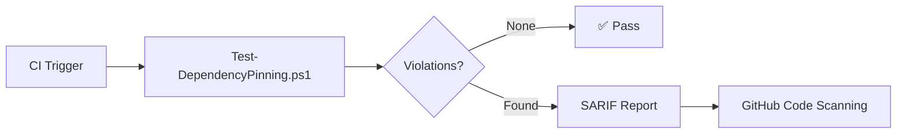

## Overview

HVE Core enforces dependency pinning to mitigate supply chain attacks. Every dependency reference in the repository must resolve to a specific, immutable version. The `Test-DependencyPinning.ps1` scanner validates all dependency types during CI and produces SARIF reports for GitHub code scanning integration.

| Dependency Type | Pinning Strategy | Example |
|---|---|---|
| GitHub Actions | Full 40-character commit SHA | `actions/checkout@a5ac7e51b41094c92402da3b24376905380afc29` |
| npm | Exact version (no ranges) | `"eslint": "9.18.0"` |
| pip | Exact version with `==` | `requests==2.31.0` |
| Shell downloads | Checksum verification | `sha256sum --check` after download |

## npm: Exact-Version Enforcement

> [!NOTE]
> npm dependencies use **exact-version enforcement** rather than SHA-pinning. Unlike GitHub Actions (where commit SHAs identify immutable source snapshots), npm packages are published as immutable registry artifacts. An exact version string like `9.18.0` is already a unique, deterministic reference.

### What Is Validated

The scanner rejects any version string that contains range operators or wildcards:

```json
{
  "dependencies": {
    "valid": "9.18.0",
    "invalid-caret": "^9.18.0",
    "invalid-tilde": "~9.18.0",
    "invalid-wildcard": "9.*",
    "invalid-range": ">=9.0.0 <10.0.0"
  }
}
```

### Validation Regex

```text
^[0-9]+\.[0-9]+\.[0-9]+(-[a-zA-Z0-9.]+)?(\+[a-zA-Z0-9.]+)?$
```

This permits standard semver (`1.2.3`), pre-release tags (`1.2.3-beta.1`), and build metadata (`1.2.3+build.42`), while rejecting all range operators.

### Why Not SHA-Pinning for npm

| Criterion | SHA-Pinning (GitHub Actions) | Exact-Version (npm) |
|---|---|---|
| Registry model | Git repositories with mutable tags | Immutable package tarballs |
| Mutability risk | Tags can be force-pushed to different commits | Published versions are permanently immutable |
| Audit tooling | `npm audit` cross-references semver, not SHAs | Full compatibility with `npm audit` |
| Lockfile integration | N/A | `package-lock.json` records integrity hashes |
| Human readability | 40-char hex strings obscure the actual version | Version is self-documenting |

## GitHub Actions: SHA Pinning

GitHub Actions references must use full 40-character commit SHAs because action tags (like `v4`) are mutable Git references that can be retargeted to arbitrary commits.

```yaml
# Rejected: mutable tag reference
- uses: actions/checkout@v4

# Accepted: immutable SHA reference
- uses: actions/checkout@a5ac7e51b41094c92402da3b24376905380afc29 # v4.2.2
```

The scanner validates that the SHA is a real 40-character hexadecimal string and optionally checks staleness against the GitHub API.

## pip: Exact-Version Pinning

Python dependencies must use the `==` operator for exact version pinning. The scanner excludes virtual environment directories (`.venv`, `venv`, `.tox`, `.nox`, `__pypackages__`) to avoid false positives from installed package metadata.

```text
# Accepted
requests==2.31.0
flask==3.0.0

# Rejected
requests>=2.31.0
flask~=3.0
```

## CI Integration

The dependency pinning scanner runs in CI as part of the security validation workflow. It produces SARIF 2.1.0 output that integrates with GitHub code scanning.



### Severity Mapping

| Scanner Severity | SARIF Level | Trigger |
|---|---|---|
| High | `error` | Unpinned or mutable dependency reference |
| Medium | `warning` | Stale pinned version with available update |
| Low | `note` | Informational findings |

### Running Locally

```powershell
# Full scan with SARIF output
./scripts/security/Test-DependencyPinning.ps1

# Results appear in logs/dependency-pinning-results.json
```

## Related Resources

* [Threat Model](threat-model.md) — Supply chain threats S-1, S-2, SC-1, and SC-4
* [Branch Protection](../contributing/branch-protection.md) — Required status checks including dependency pinning

---

🤖 *Crafted with precision by ✨Copilot following brilliant human instruction, then carefully refined by our team of discerning human reviewers.*
